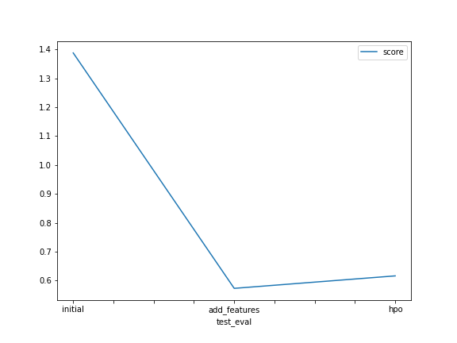

# Report: Predict Bike Sharing Demand with AutoGluon Solution
#### Shinto Theruvil Manuel

## Initial Training
### What did you realize when you tried to submit your predictions? What changes were needed to the output of the predictor to submit your results?
The prediction results has negative values (less than zero). To meet the Kaggle submission requirements, all the negative values are replaced with zero.

### What was the top ranked model that performed?
The top ranked model from the initial training was **WeightedEnsemble_L3**. The Kaggle submission for this model resulted in the initial score of **1.38790**

## Exploratory data analysis and feature creation
### What did the exploratory analysis find and how did you add additional features?
The exploratory analysis showed different data types which could be further feature engineered. Converted the **season** and **weather** fields into categorical types.  Exatracted **month**, **day** and **hour** features from the **datetime** column

### How much better did your model preform after adding additional features and why do you think that is?
The additional features improved the Kaggle submission score from **1.38790** to **0.57274**

## Hyper parameter tuning
### How much better did your model preform after trying different hyper parameters?
In fact, the hyperparameter tuning did not improve the model performace.

### If you were given more time with this dataset, where do you think you would spend more time?
* Adding more features
* Try more parameters with the hyper parameter tuning

### Create a table with the models you ran, the hyperparameters modified, and the kaggle score.
|model|hpo1|hpo2|hpo3|score|
|--|--|--|--|--|
|initial|default|default|default|1.38790|
|add_features|default|default|default|0.57274|
|hpo(LightGBM)|num_boost_round:200|num_leaves:36||0.61595|

### Create a line plot showing the top model score for the three (or more) training runs during the project.

### Create a line plot showing the top kaggle score for the three (or more) prediction submissions during the project.

## Summary

This project used the [AutoGluon](https://auto.gluon.ai/stable/index.html) library to train several models for the competition [Bike Sharing Demand](https://www.kaggle.com/c/bike-sharing-demand/overview) in Kaggle.   The submissions are evaluted on the **Root Mean Squared Logarithmic Error (RMSLE)**.  The RMSLE measures the ratio between the actual values and predicted values, and takes the log of the predictions and actual values.

Using the inital data without any preprocessing resulted in a score of 1.39490 in the Kaggle leaderboard.
After some feature engineering, such as categorization of weather and seaso column, and extraction of different datetime propeties the score improved to 0.55140

The first hyperparameter tuning resulted in the score of 0.66276. The second attempt which expanded the range of paramters resulted in the improved score of 0.60190 
